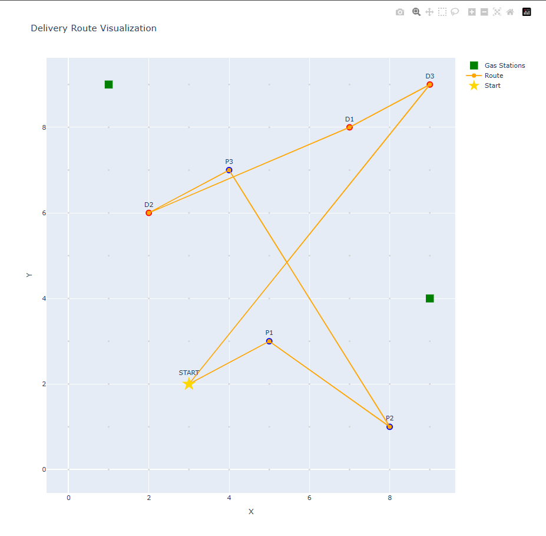

# Delivery Route Optimizer

Hệ thống tối ưu lộ trình giao hàng sử dụng thuật toán Greedy và A* pathfinding.

## Mô tả bài toán

Tối ưu lộ trình xe giao hàng trên bản đồ lưới `n × m` với các ràng buộc:

**Ràng buộc:**
- Tải trọng tối đa: W kg
- Dung tích xăng: F lít (tiêu thụ 1 lít/20 ô)
- Xe phải lấy hàng trước khi giao
- Có thể thực hiện nhiều chuyến nếu cần

**Mục tiêu:** Tối thiểu hóa quãng đường hoặc số lần đổ xăng

## Cài đặt

```bash
# Tạo virtual environment
python -m venv venv

# Kích hoạt venv
venv\Scripts\activate  # Windows
source venv/bin/activate  # Linux/Mac

# Cài đặt dependencies
pip install -r requirements.txt
```

## Chạy chương trình

```bash
python delivery_optimizer.py
```

**Output:**
- Console: Lộ trình chi tiết từng bước
- File HTML: Visualization tương tác (`delivery_route.html`)

Hình minh họa thể hiện mô hình trực quan cho bài toán tối ưu lộ trình xe giao hàng trên bản đồ lưới hai chiều. Trên hình, hệ trục tọa độ X–Y biểu diễn bản đồ n × m, trong đó ngôi sao màu vàng là vị trí xuất phát ban đầu của xe khi chưa chở hàng và bình xăng đầy. Các điểm màu xanh dương (P1, P2, P3) là vị trí lấy hàng của các đơn, còn các điểm màu đỏ (D1, D2, D3) tương ứng là vị trí giao hàng. Các ô vuông màu xanh lá biểu thị các trạm xăng, nơi xe có thể dừng lại để đổ đầy nhiên liệu khi cần. Đường màu cam nối các điểm cho thấy lộ trình di chuyển thực tế của xe từ điểm xuất phát, qua các điểm lấy hàng, giao hàng và trạm xăng. Lộ trình này được xây dựng sao cho tại mọi thời điểm tổng khối lượng hàng trên xe không vượt quá tải trọng tối đa W, đồng thời xe luôn có đủ nhiên liệu để di chuyển theo các hướng hợp lệ trên lưới. Qua đó, hình ảnh giúp minh họa rõ ràng cách xe hoàn thành tất cả đơn hàng một cách hợp lệ, đồng thời hỗ trợ đánh giá và tối ưu các tiêu chí như tổng quãng đường di chuyển hoặc số lần đổ xăng.

## Demo
## 🎥 Video DEMO
👉 https://drive.google.com/file/d/1XNuhWnLIMsYLlMwgSpVXsQLBCxUZUfvi/view?usp=sharing


## Thuật toán

### 1. Greedy Algorithm (Tham lam)
**Chiến lược:**
- Chọn đơn hàng gần nhất có thể lấy (không vượt tải)
- Ưu tiên pickup trước, delivery sau
- Kiểm tra nhiên liệu trước mỗi bước

**Độ phức tạp:** O(k²) với k là số đơn hàng

### 2. A* Pathfinding
**Công thức:** f(n) = g(n) + h(n)
- g(n): Chi phí từ start đến n
- h(n): Manhattan distance từ n đến goal

**Độ phức tạp:** O(n×m×log(n×m))

## Quy trình hoạt động

```
1. START tại vị trí xuất phát
   ↓
2. PICKUP PHASE
   - Chọn đơn gần nhất (feasible)
   - Kiểm tra fuel → Refuel nếu cần
   - Di chuyển và lấy hàng
   - Lặp lại cho đến khi đầy tải hoặc hết đơn
   ↓
3. DELIVERY PHASE
   - Chọn điểm giao gần nhất
   - Kiểm tra fuel → Refuel nếu cần
   - Di chuyển và giao hàng
   - Lặp lại cho đến khi hết hàng trên xe
   ↓
4. Nếu còn đơn → RETURN về start (chuyến mới)
   Nếu hết đơn → FINAL_RETURN
```

## Input/Output

### Input
```python
grid_size = (10, 10)  # Kích thước lưới

vehicle = Vehicle(
    position=(2, 3),      # Vị trí xuất phát
    capacity=50,          # Tải trọng tối đa (kg)
    fuel_capacity=30      # Dung tích xăng (lít)
)

orders = [
    Order(id=1, pickup=(3,5), delivery=(8,7), weight=20),
    Order(id=2, pickup=(1,8), delivery=(6,2), weight=15),
    Order(id=3, pickup=(7,4), delivery=(9,9), weight=10)
]

gas_stations = [(4,9), (9,1)]  # Tọa độ trạm xăng
```

### Output
```
DELIVERY ROUTE PLAN
Step 1: START at (2,3) - Fuel: 30.00L, Load: 0kg
Step 2: PICKUP Order#1 at (3,5) - Distance: 3, Fuel: 29.85L, Load: 20kg
Step 3: PICKUP Order#2 at (1,8) - Distance: 5, Fuel: 29.60L, Load: 35kg
Step 4: PICKUP Order#3 at (7,4) - Distance: 10, Fuel: 29.10L, Load: 45kg
Step 5: DELIVERY Order#2 at (6,2) - Distance: 3, Fuel: 28.95L, Load: 30kg
Step 6: DELIVERY Order#1 at (8,7) - Distance: 7, Fuel: 28.60L, Load: 10kg
Step 7: DELIVERY Order#3 at (9,9) - Distance: 3, Fuel: 28.45L, Load: 0kg
Step 8: FINAL_RETURN to (2,3) - Distance: 13, Fuel: 27.80L

METRICS:
- Total distance: 44 units
- Refuel count: 0
- Trips: 1
```

## Cấu trúc dữ liệu

```python
@dataclass
class Order:
    id: int
    pickup: Tuple[int, int]
    delivery: Tuple[int, int]
    weight: float

@dataclass
class Vehicle:
    position: Tuple[int, int]
    capacity: float
    fuel_capacity: float
    fuel_consumption: float = 0.05  # 1L/20 cells
```

## Visualization

File HTML tạo ra bao gồm:
- 🟦 Pickup points (P1, P2, P3)
- 🟥 Delivery points (D1, D2, D3)
- 🟩 Gas stations
- ⭐ Start position
- 🟧 Route path

Mở `delivery_route.html` trong browser để xem.

## Tùy chỉnh

Thay đổi tham số trong hàm `main()`:
```python
grid_size = (100, 100)  # Lưới lớn hơn
vehicle.capacity = 100   # Tăng tải trọng
vehicle.fuel_capacity = 50  # Tăng xăng
```

## Giới hạn

- Không xử lý chướng ngại vật trên lưới
- Greedy không đảm bảo tối ưu toàn cục
- Phù hợp với bài toán quy mô vừa và nhỏ

## License

MIT
